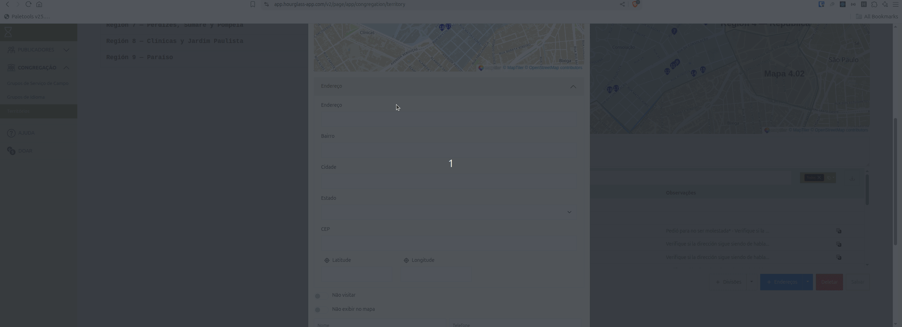

# Hourglass Address Filler

> ⚠️ **Attention:** Currently, it only works with Hourglass in Portuguese - Brazil.

Hourglass Address Filler is a Google Chrome extension that automatically fills Hourglass address forms.

## Overview

It uses the Google Maps address pattern and Nominatin Open Street Map API to fill automatically the address, city, state, zip code, latitude and longitude fields.

## Installation

1. Download the ZIP file from the [release github page](https://github.com/iagosaito/hourglass-address-filler/releases). Alternatively, you can clone the repository using Git:

   ```bash
   git clone git@github.com:<YOUR_USERNAME>/hourglass-address-filler.git
   ```

2. Navigate to the extension directory:

   ```bash
   cd hourglass-address-filler
   ```

3. [Load the extension in Chrome](https://developer.chrome.com/docs/extensions/get-started/tutorial/hello-world#load-unpacked):

   - Open Chrome and go to `chrome://extensions/`
   - Enable "Developer mode" (toggle switch in the top right corner)
   - Click "Load unpacked" and select the extension directory

4. The extension should now be installed and active.

## How to Use



1. Navigate to the Hourglass new address form.
2. Open the extension popup by clicking on the extension icon in the Chrome toolbar and paste the address in Google Maps format, like:

   ```
   R. Dr. Vila Nova, 245 - Vila Buarque, São Paulo - SP, 01222-020
   ```

3. Click the "Fill Address" button.
4. The address fields should be automatically filled in the form, including latitude and longitude.

## Contributing

Contributions are welcome! If you have suggestions or improvements, feel free to open an issue or submit a pull request.

For any questions or feedback, please open an issue on the GitHub repository or contact the author.

## License

This project is licensed under the MIT License. See the [LICENSE](LICENSE) file for details.
