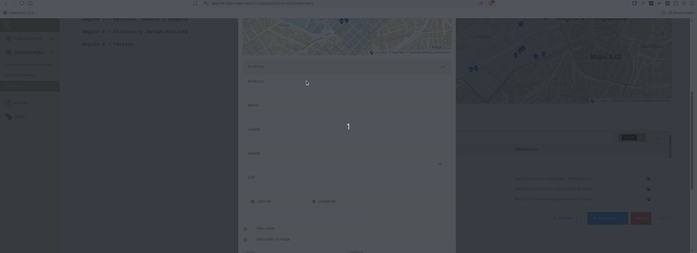

# Hourglass Address Filler

> ⚠️ **Attention:** Currently, it only works with Hourglass in Portuguese - Brazil.

Hourglass Address Filler is a Google Chrome extension that automatically fills Hourglass address forms.



## Overview

It uses the Google Maps address pattern and Nominatim Open Street Map API to prepare an Hourglass address payload, show a review preview, and submit the address directly to Hourglass after approval.

### AI-Powered Address Parsing

The extension supports **flexible address parsing** using Claude AI, allowing you to paste addresses in various formats (like WhatsApp messages) and have them automatically interpreted.

**Features:**
- **Intelligent fallback**: Tries regex pattern matching first (fast), falls back to Claude AI for unstructured addresses
- **Cost-effective**: Approximately $0.09/month for 30 addresses
- **Secure**: API key stored locally in your browser

> ⚠️ **Important Disclaimer**: The use of the Anthropic API key and associated costs are entirely your responsibility. The API key is stored locally in your browser. Never share your API key with third parties. Monitor your usage at [console.anthropic.com](https://console.anthropic.com/settings/usage).

## Configuration

### Setting up Claude AI (Optional but Recommended)

To enable AI-powered parsing for addresses in non-standard formats:

1. Get a free Anthropic API key:
   - Visit [console.anthropic.com](https://console.anthropic.com/settings/keys)
   - Sign up or log in
   - Create a new API key

2. Configure the extension:
   - Right-click the extension icon and select "Options" (or go to `chrome://extensions/` → Extension details → Extension options)
   - Paste your API key in the configuration page
   - Click "Save"

**Without an API key**, the extension will still work with perfectly formatted Google Maps addresses using the regex parser.

## Installation

1. Download the ZIP file from the [release github page](https://github.com/iagosaito/hourglass-address-filler/releases). Alternatively, you can clone the repository using Git:

   ```bash
   git clone git@github.com:<YOUR_USERNAME>/hourglass-address-filler.git
   ```

2. Navigate to the extension directory:

   ```bash
   cd hourglass-address-filler
   ```

3. [Load the extension in Chrome](https://developer.chrome.com/docs/extensions/get-started/tutorial/hello-world#load-unpacked):

   - Open Chrome and go to `chrome://extensions/`
   - Enable "Developer mode" (toggle switch in the top right corner)
   - Click "Load unpacked" and select the extension directory

4. The extension should now be installed and active.

## How to Use

1. Navigate to Hourglass and open the territory/address page.

2. Open the extension popup by clicking on the extension icon in the Chrome toolbar.

3. Paste the address in one of the supported formats:

   **Google Maps format (works without API key):**
   ```
   R. Dr. Vila Nova, 245 - Vila Buarque, São Paulo - SP, 01222-020
   ```
split into focused modules:

- `src/popup/index.js`: popup event orchestration and UI logic
- `src/core/api/addressClient.js`: backend address resolution client
- `src/core/api/hourglassApi.js`: Hourglass API integration
- `src/core/config/backendConfig.js`: configuration management for backend settings
- `src/core/domain/addressRequest.js`: payload builder for Hourglass address submissions
- `src/core/domain/geofence.js`: point-in-polygon and multipolygon helpers
- `src/core/domain/territoryFinder.js`: territory lookup by coordinates
- `tests/*.test.js`: unit tests for core logic
- `options.html` / `options.js`: configuration page for backend settings
5. The extension will preview the exact payload, including territory, location, and address fields, and you can approve or deny the submission before it is sent.

## Project Structure

The extension code is now split into focused modules:

- `src/popup/index.js`: popup event orchestration.
- `src/core/api/addressClient.js`: backend address resolution.
- `src/core/api/hourglassApi.js`: Hourglass API integration.
- `src/core/domain/addressRequest.js`: Hourglass payload builder.
- `src/core/domain/geofence.js`: point-in-polygon and multipolygon helpers.
- `src/core/domain/territoryFinder.js`: territory lookup by coordinates.
- `tests/*.test.js`: unit tests for core logic.

## Running Tests

This project uses the Node.js built-in test runner.

```bash
npm test
```

## Contributing

Contributions are welcome! If you have suggestions or improvements, feel free to open an issue or submit a pull request.

For any questions or feedback, please open an issue on the GitHub repository or contact the author.

## License

This project is licensed under the MIT License. See the [LICENSE](LICENSE) file for details.
